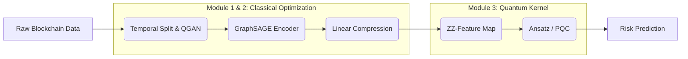

# Quantum-Graph-AML-Detection 威震＠NTUB


## 📖 Project Abstract (研究摘要)

This project implements a **Hybrid Quantum-Classical Graph Neural Network (Hybrid QGNN)** designed to detect illicit cryptocurrency transactions (Anti-Money Laundering, AML) on blockchain networks. 

Targeting the **NISQ (Noisy Intermediate-Scale Quantum)** era constraints, we propose a dual-stage architecture:
1.  **Classical Encoder**: Uses **GraphSAGE** to handle dynamic graph structures and solve the "over-smoothing" problem in deep GNNs.
2.  **Quantum Kernel**: Utilizes **ZZ-Feature Maps** and Variational Quantum Circuits (VQC) to map low-dimensional features into high-dimensional Hilbert Space, enhancing the separability of illicit transactions (typically <2% of data).
3. **Real-time On-chain Monitoring:** Integrated `Etherscan API` client to fetch live internal transactions for detecting DeFi layering and contract interactions.
4. **QGAN Data Augmentation:** Utilizes `EfficientSU2` generator with `SPSA` optimizer to synthesize illicit transaction samples, mitigating mode collapse in imbalanced datasets.

This repository serves as the Proof-of-Concept (PoC) implementation for the research proposal.

---

## 🏗️ System Architecture (系統架構)

The architecture is designed to minimize quantum noise impact while maximizing feature extraction capabilities:


## Repository Structure

```text
Quantum-Graph-AML-Detection/
│
├── .gitignore               # <--- 關鍵！防止 10K 垃圾檔案災難 (venv, data, cache)
├── README.md                # 專案說明文件
├── requirements.txt         # Python 套件清單 (包含 requests, pandas, qiskit, torch_geometric...)
├── .env                     # [新增] 用來放 API KEY 的設定檔 (不要上傳到 Git！)
│
├── data/                    # 資料存放區 (一定要加到 .gitignore)
│   ├── raw/                 # 原始資料 (例如 Kaggle 下載的 csv)
│   ├── processed/           # 清洗後、轉成 Graph 格式的資料 (.pt, .pkl)
│   └── external/            # 從 Etherscan 抓下來的暫存資料
│
├── notebooks/               # Jupyter Notebooks 實驗區
│   ├── 01_Data_Preprocessing.ipynb       # 靜態資料清洗
│   ├── 02_Graph_Construction.ipynb       # 建構圖結構
│   ├── 03_Quantum_GNN_Model.ipynb        # 量子模型訓練
│   └── 04_Etherscan_Data_Integration.ipynb  # 即時資料抓取測試
│
├── src/                     # 核心程式碼 (原本的 .py 檔都放這)
│   ├── __init__.py          # 讓 src 變成一個 Python Package
│   ├── eth_client.py        # [您的新檔案] Etherscan API 介接模組
│   ├── graph_utils.py       # 圖結構處理工具 (Adjacency Matrix, Edge Index)
│   ├── quantum_layer.py     # 量子電路層定義 (Qiskit/PennyLane)
│   ├── model.py             # GNN / QGNN 模型架構
│   ├── train.py             # 訓練迴圈邏輯
│   └── utils.py             # 通用工具 (Logger, Config Loader)
│
├── models/                  # 訓練好的模型權重 (.pth)
│   └── saved_models/
│
└── tests/                   # 單元測試 (Unit Tests)
    ├── __init__.py
    └── test_eth_client.py   # 測試 API 連線是否正常

