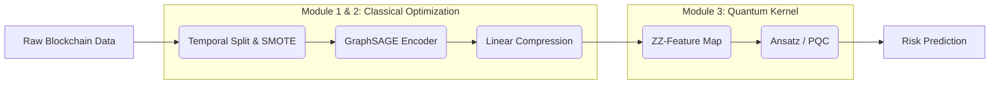

# Quantum-Graph-AML-Detection 威震＠NTUB


## 📖 Project Abstract (研究摘要)

This project implements a **Hybrid Quantum-Classical Graph Neural Network (Hybrid QGNN)** designed to detect illicit cryptocurrency transactions (Anti-Money Laundering, AML) on blockchain networks. 

Targeting the **NISQ (Noisy Intermediate-Scale Quantum)** era constraints, we propose a dual-stage architecture:
1.  **Classical Encoder**: Uses **GraphSAGE** to handle dynamic graph structures and solve the "over-smoothing" problem in deep GNNs.
2.  **Quantum Kernel**: Utilizes **ZZ-Feature Maps** and Variational Quantum Circuits (VQC) to map low-dimensional features into high-dimensional Hilbert Space, enhancing the separability of illicit transactions (typically <2% of data).

This repository serves as the Proof-of-Concept (PoC) implementation for the research proposal.

---

## 🏗️ System Architecture (系統架構)

The architecture is designed to minimize quantum noise impact while maximizing feature extraction capabilities:


## Repository Structure

```text
Quantum-Graph-AML-Detection/
├── data/
│   ├── raw/                  # 存放 Elliptic Data Set (無需上傳大檔，放 README 說明下載點)
│   └── processed/            # 存放經過 GraphSAGE 採樣後的子圖數據
├── notebooks/
│   ├── 01_Data_Preprocessing.ipynb  # 資料清理與時序切分 [Source 49, 110]
│   ├── 02_Quantum_Circuit_Demo.ipynb # 展示 ZZ-Feature Map 與 VQC 電路視覺化
│   └── 03_Hybrid_Training_Demo.ipynb # 小規模訓練演示 (Proof of Concept)
├── src/
│   ├── __init__.py
│   ├── classical_gnn.py      # GraphSAGE 模型定義 [Source 53]
│   ├── quantum_circuit.py    # Qiskit 量子線路定義 [Source 81]
│   ├── hybrid_model.py       # PyTorch 與 Qiskit 的混合層串接
│   └── utils.py              # 評估指標 (F1, AUC) 與視覺化工具
├── results/
│   ├── figures/              # 存放 t-SNE 與混淆矩陣圖片 [Source 127, 132]
│   └── logs/
├── requirements.txt          # qiskit, torch, torch-geometric 等依賴
└── README.md                 # 專案核心說明

 **Real-time On-chain Monitoring:** Integrated `Etherscan API` client to fetch live internal transactions for detecting DeFi layering and contract interactions.
 
 **QGAN Data Augmentation:** Utilizes `EfficientSU2` generator with `SPSA` optimizer to synthesize illicit transaction samples, mitigating mode collapse in imbalanced datasets.